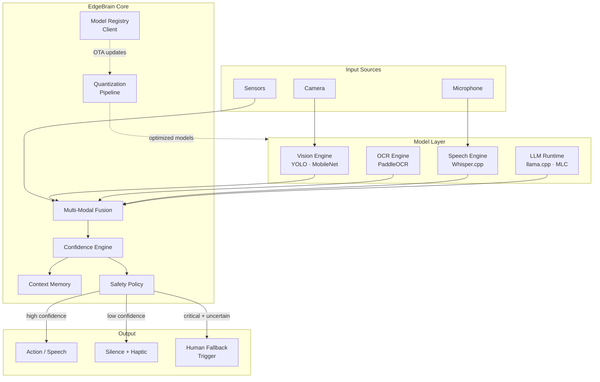
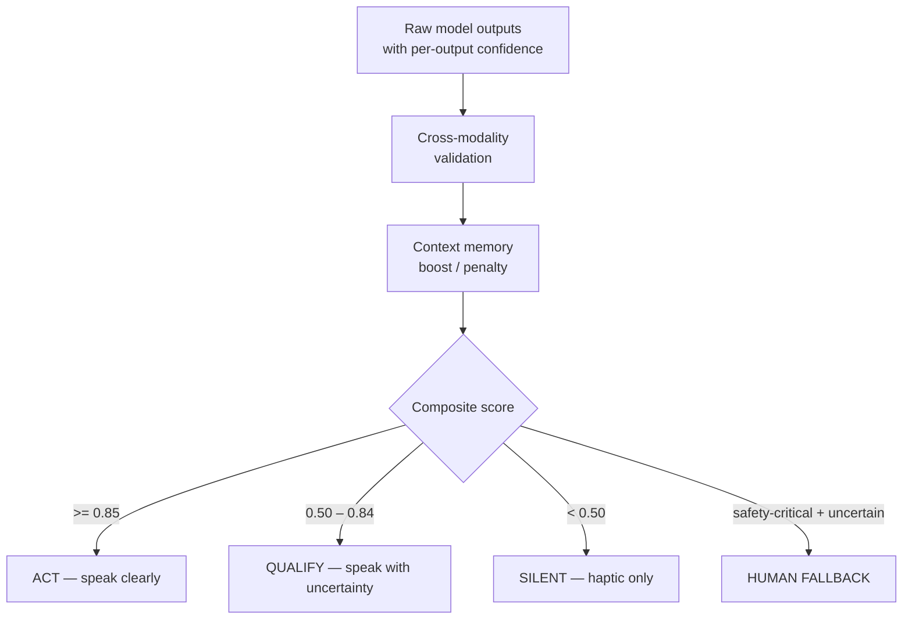
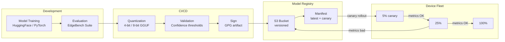

# EdgeBrain

**A trust-aware on-device AI runtime for safety-critical applications.**

> *Most AI platforms optimize for speed and accuracy. EdgeBrain optimizes for trustworthiness.*

EdgeBrain is the inference and confidence engine powering VenKon AI products. It runs vision, speech, OCR, and language models entirely on-device — with a confidence scoring layer that determines when an AI output is safe to act on, and when to stay silent.

[](LICENSE)
[]()

---

## The Core Problem

Every on-device AI platform today answers the same question:

> "How do we make inference faster, smaller, cheaper?"

Nobody is asking:

> "How do we make inference **trustworthy enough to act on in the real world**?"

In safety-critical applications — accessibility navigation, healthcare, industrial control — **a wrong answer is worse than no answer**. EdgeBrain is built around this principle.

---

## Architecture



---

## Confidence Engine

The confidence engine is EdgeBrain's core differentiator. Rather than always returning an answer, it computes a composite trust score across modalities and decides whether to act, qualify, or stay silent.



---

## MLOps Pipeline



---

## Research Tracks

### Track 1: Small Language Models
Benchmarking 1B–8B parameter models on consumer hardware:
- Google Gemma 2B / 3B
- Microsoft Phi-3 Mini / Phi-4 Mini
- Qwen 2.5 1.5B / 3B
- Llama 3.2 1B / 3B

### Track 2: Vision Models
Object detection on mobile NPU:
- YOLOv11 nano / small
- MobileNet V3
- EfficientDet-Lite

### Track 3: OCR
Multi-script text recognition:
- PaddleOCR (best for non-Latin)
- Tesseract 5.x
- Apple Vision Framework (iOS)

### Track 4: Speech
Offline transcription:
- whisper.cpp (tiny / base)
- Vosk
- Android SpeechRecognizer (offline mode)

---

## Benchmark Matrix

Initial research targets (EdgeBench v0.1):

| Device Class | RAM | Model | Tokens/s | Latency | Battery/hr |
|---|---|---|---|---|---|
| Mid-range Android | 6GB | Phi-3 Mini | TBD | TBD | TBD |
| Flagship Android | 12GB | Gemma 3B | TBD | TBD | TBD |
| Raspberry Pi 5 | 8GB | Qwen 1.5B | TBD | TBD | TBD |
| MacBook M2 | 16GB | Llama 3.2 3B | TBD | TBD | TBD |

Results will be published in [`benchmarks/`](benchmarks/).

---

## Roadmap

**Phase 1 — Research (30 days)**
- [ ] Benchmark LLMs on Android (Gemma, Phi, Qwen)
- [ ] Benchmark Whisper variants offline
- [ ] Benchmark PaddleOCR vs Tesseract on signage
- [ ] First findings published

**Phase 2 — POC (60 days)**
- [ ] Voice assistant: Whisper → local LLM → TTS, fully offline
- [ ] Vision detection: YOLOv11 nano on Android camera
- [ ] Confidence engine v0.1

**Phase 3 — SDK (90 days)**
- [ ] EdgeBrain Android library
- [ ] EdgeBrain iOS Swift package
- [ ] SenseWay integration
- [ ] EdgeBench public dashboard

---

## Repository Structure

```
edgebrain/
├── runtime/          # Core inference engine (coming)
├── benchmarks/       # Benchmark results and runner
├── docs/
│   ├── architecture.md
│   └── adr/
├── .github/
│   └── workflows/
└── README.md
```

---

## Powers

```
VenKon AI Applications
├── senseway    ← Powered by EdgeBrain
└── (future)    ← Powered by EdgeBrain

EdgeBrain
├── Vision Engine
├── OCR Engine
├── Speech Engine
├── LLM Runtime
├── Confidence Engine    ← Core differentiator
└── Safety Policy
```

---

## License

MIT © [VenKon AI](https://github.com/venkonai)
